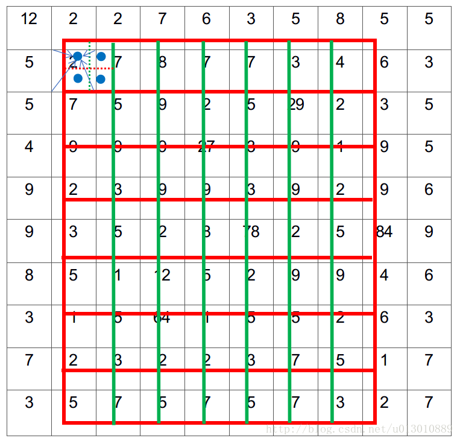

# DaSiamRPNWithOfflineTraining

This repository adds offline training module and testing module (including distractor-awareness and local2global strategy) to the original PyTorch implementation of [DaSiamRPN](https://github.com/foolwood/DaSiamRPN).

## Introduction

**SiamRPN** formulates the task of visual tracking as a task of localization and identification simultaneously, initially described in an [CVPR2018 spotlight paper](http://openaccess.thecvf.com/content_cvpr_2018/papers/Li_High_Performance_Visual_CVPR_2018_paper.pdf). (Slides at [CVPR 2018 Spotlight](https://drive.google.com/open?id=1OGIOUqANvYfZjRoQfpiDqhPQtOvPCpdq))

**DaSiamRPN** improves the performances of SiamRPN by (1) introducing an effective sampling strategy to control the imbalanced sample distribution, (2) designing a novel distractor-aware module to perform incremental learning, (3) making a long-term tracking extension. [ECCV2018](https://arxiv.org/pdf/1808.06048.pdf). (Slides at [VOT-18 Real-time challenge winners talk](https://drive.google.com/open?id=1dsEI2uYHDfELK0CW2xgv7R4QdCs6lwfr))

Specifically, for (2), this repository implements ROI-align technique to achieve similarity matching between x and z. The insight of the ROI-align implementation can be seen from the figure below.

## Prerequisites

CPU: Intel(R) Core(TM) i7-7700 CPU @ 3.60GHz
GPU: NVIDIA GTX1060

- python2.7
- pytorch == 0.3.1
- numpy
- opencv

## Training Procedure
`python code/train.py`

The model will be saved in ./output/weights/

## Testing Procedure
`python code/test.py`

## Postscript
Currently, this repo remains under construction, meaning that its effectiveness is not guaranteed. But one can still get some insights from reading this repo, including myself. And that is exactly what it really matters. However, more is coming in the immediate future, including: (1) the sampling strategy to control the imbalanced sample distribution and (2) other implementation details not specified clearly in the related paper.

